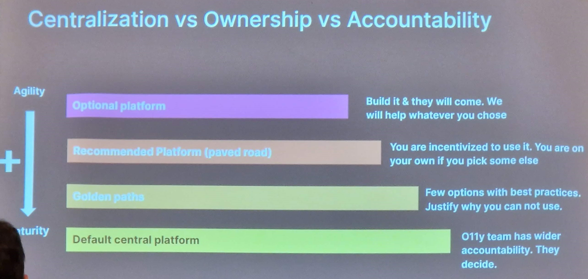
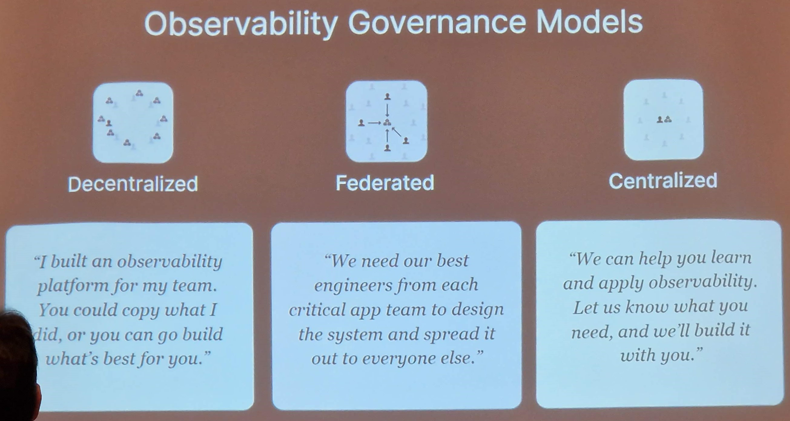
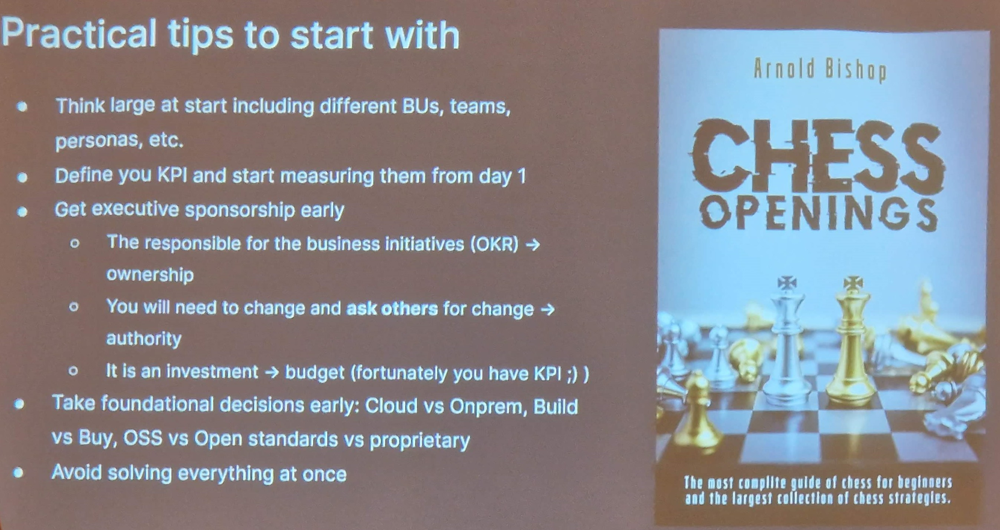

## 2023-10-XX What's new in o11y ?

The last week, I went to Grafana Paris Sessions.

### Grafana Sessions Paris (aka Obs sessions)

There was 3 companies feedback including SNCF and organizational / scalling guide of observability product in a company where the topic was Grafana but those principles apply for cloud and observability product in general.

[Abdelkrim Hadjidj](https://grafana.com/author/abdelkrim_hadjidj/) uses a chess metaphor to explain how to scale observability solution in a company.

The conclusion is that it is hard to scale the product alone in a company without support like a sponsor, a strategy, deployment (change management and pairing), ...

#### Observability Governance Models
There are different models when integrating internal software in a company with pros and cons.

More than 70% companies have a centralized model for the sake of maintenance / SLA.

##### Decentralised
This is the almost "no brainer" solution by sharing the experience in a peer to peer way.

This is great at the beginning but can become really challenging at scale to have features / maintenance / maturity at the same level.

Do you want to maintain lots of grafana instances ?

If you have such problem, the Federated and Centralized models should be considered

##### Federated
The model is centralized but the software is not spread anymore.
This mode requires defined roles because shared responsability on the same perimeter / role does not really work.

"Nobody care when the responsability is shared"

Depending the context, this model is not recommended if datasources and dashboards integration are hard and very specific. SNCF was monitoring very specific infrastructure components and created dashboards for the support in a centralized environment model.

##### Centralized
This is the most used model.
Roles should be defined and can be from viewer to editor and developers team can participate on the collector part but the model remains centralized to support SLA/Security and constraints.

#### You Build it, you run it (YBIYRI), you pay for it
As soon as there is more and more teams integrated on the platform, observing the platform becomes important.

The "Avoid solving everything at once" motto is important. Starting from monitoring "fair usage", then integrating alert and finally implement a strategy of multitenancy is a big part of an observability platform team.

#### Strategy

I find ownership, budget (sponsor) and early decisions (cloud / On-premise Build vs Buy) the top most required properties important to get first.

When the use cases do not fit with observability solutions (store PB of logs for years, ...), the Build should be considered to those very specific uses cases. The post [What is not an observability solution ?](./../What_is_not_an_o11y_solution.md) can help to list acceptable trade-offs and use cases.
